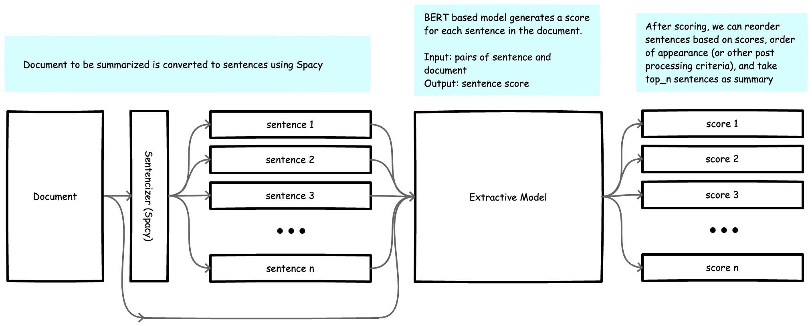
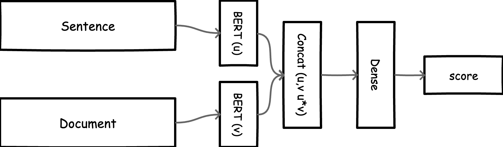

## Extractive Summarization with BERT 



> This repo is part of work done while at Cloudera Fast Forward labs. Check out the full project [here](https://github.com/fastforwardlabs/summarize). 

In extractive summarization, the task is to extract subsets (sentences) from a document that represent a valid summary. 
In this repo, we treat extractive summarization as a classification problem where we predict a class for each sentence in a document (i.e. belonging to the summary or not). We can then _assemble_ a summary based on these scores e.g. the highest scoring sentences reorded by some pertinent criteria (e.g. order of appearance in document, grammatical correctness, etc).

- Model Input: a sentence, and the entire document 
- Model Output: A score representing likelihood of belonging in the summary or not.   


### Model Implementation 



- We use sentence bert models to get representations for our text. We use the smallest model (sentence-transformers/paraphrase-MiniLM-L3-v2). 
Note that this can be replaced by a larger more accurate model. See the list of sentence bert pretrained [models](https://www.sbert.net/docs/pretrained_models.html#sentence-embedding-models).
- Representations for sentence and document are concatenated and fed to a Dense layer and then prediction output. 
- Entire model is finetuned on the CNN/Dailymail dataset. 

## Example Results

The document:

```
Birds are a group of warm-blooded vertebrates constituting the class Aves /ˈeɪviːz/, characterised by feathers, toothless beaked jaws, the laying of hard-shelled eggs, a high metabolic rate, a four-chambered heart, and a strong yet lightweight skeleton. Birds live worldwide and range in size from the 5.5 cm (2.2 in) bee hummingbird to the 2.8 m (9 ft 2 in) ostrich. There are about ten thousand living species, more than half of which are passerine, or “perching” birds. Birds have wings whose development varies according to species; the only known groups without wings are the extinct moa and elephant birds. Wings, which evolved from forelimbs, gave birds the ability to fly, although further evolution has led to the loss of flight in some birds, including ratites, penguins, and diverse endemic island species. The digestive and respiratory systems of birds are also uniquely adapted for flight. Some bird species of aquatic environments, particularly seabirds and some waterbirds, have further evolved for swimming. Birds are feathered theropod dinosaurs and constitute the only known living dinosaurs. Likewise, birds are considered reptiles in the modern cladistic sense of the term, and their closest living relatives are the crocodilians. Birds are descendants of the primitive avialans (whose members include Archaeopteryx) which first appeared about 160 million years ago (mya) in China. According to DNA evidence, modern birds (Neornithes) evolved in the Middle to Late Cretaceous, and diversified dramatically around the time of the Cretaceous–Paleogene extinction event 66 mya, which killed off the pterosaurs and all known non-avian dinosaurs. Many social species pass on knowledge across generations, which is considered a form of culture. Birds are social, communicating with visual signals, calls, and songs, and participating in such behaviours as cooperative breeding and hunting, flocking, and mobbing of predators. The vast majority of bird species are socially (but not necessarily sexually) monogamous, usually for one breeding season at a time, sometimes for years, but rarely for life. Other species have breeding systems that are polygynous (one male with many females) or, rarely, polyandrous (one female with many males). Birds produce offspring by laying eggs which are fertilised through sexual reproduction. They are usually laid in a nest and incubated by the parents. Most birds have an extended period of parental care after hatching. Many species of birds are economically important as food for human consumption and raw material in manufacturing, with domesticated and undomesticated birds being important sources of eggs, meat, and feathers. Songbirds, parrots, and other species are popular as pets. Guano (bird excrement) is harvested for use as a fertiliser. Birds figure throughout human culture. About 120 to 130 species have become extinct due to human activity since the 17th century, and hundreds more before then. Human activity threatens about 1,200 bird species with extinction, though efforts are underway to protect them. Recreational birdwatching is an important part of the ecotourism industry. 

```

And the summary:

```
Birds live worldwide and range in size from the 5.5 cm (2.2 in) bee hummingbird to the 2.8 m (9 ft 2 in) ostrich. 66 mya, which killed off the pterosaurs and all known non-avian dinosaurs. Human activity threatens about 1,200 bird species with extinction, though efforts are underway to protect them.

```

## Notebooks

- Data [Preprocessing](notebooks/01_CNN_DailyMail_Preprocess.ipynb): This notebook downloads the CNN/Dailymail dataset and preprocesses them. Note: This notebook takes a couple hours to run, the sort of thing you run and come back later.
- Model Training [[Pytorch](notebooks/02_SentenceBert_for_Extractive_Text_Summarization_Model_Pytorch.ipynb), Tensorflow]: Train an extractive summarization Model 
- Inference [[Pytorch](notebooks/03_Extractive_Summarization_Inference.ipynb)]: Run inference using the extractive model trained in the previous notebook, compare with abstractive summaries created with pretrained models from the HuggingFace library.
